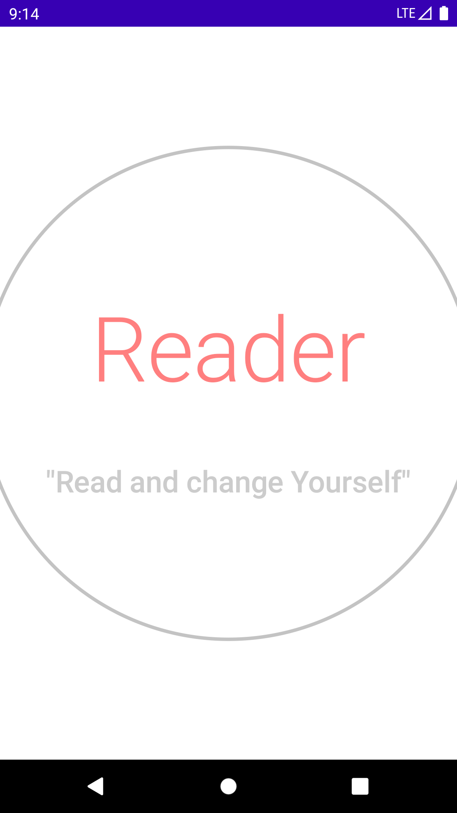
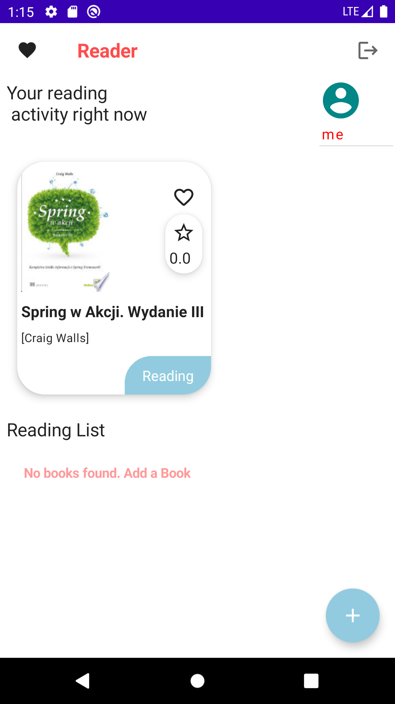
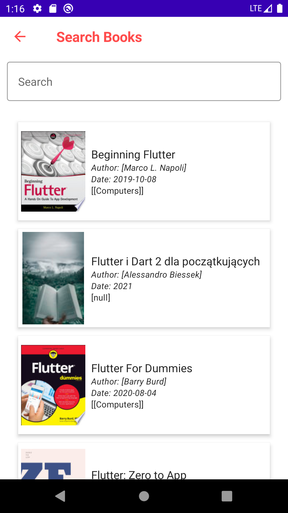
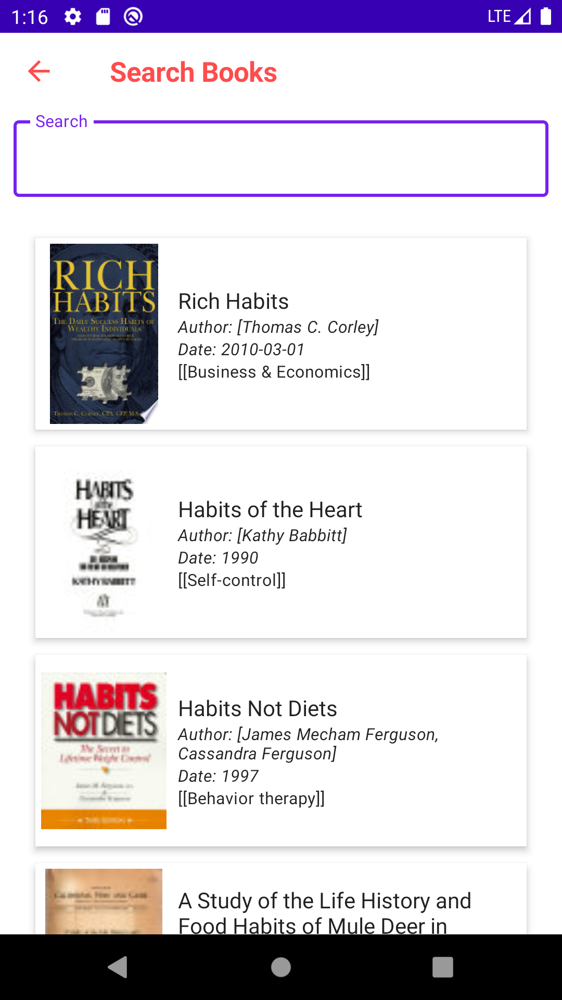
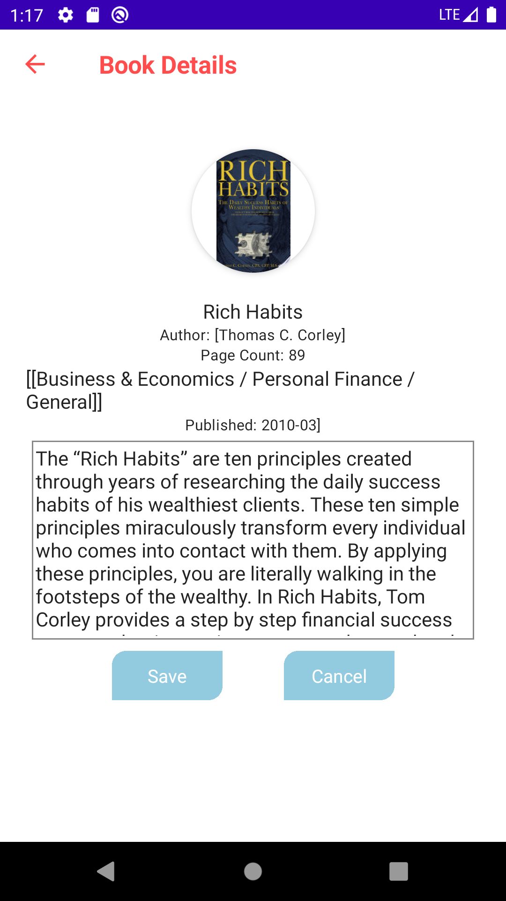
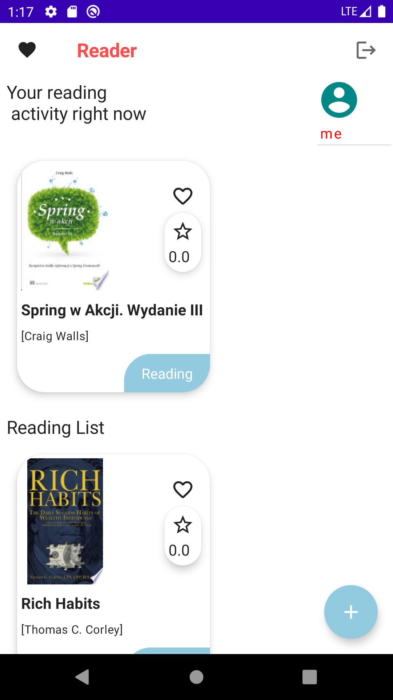
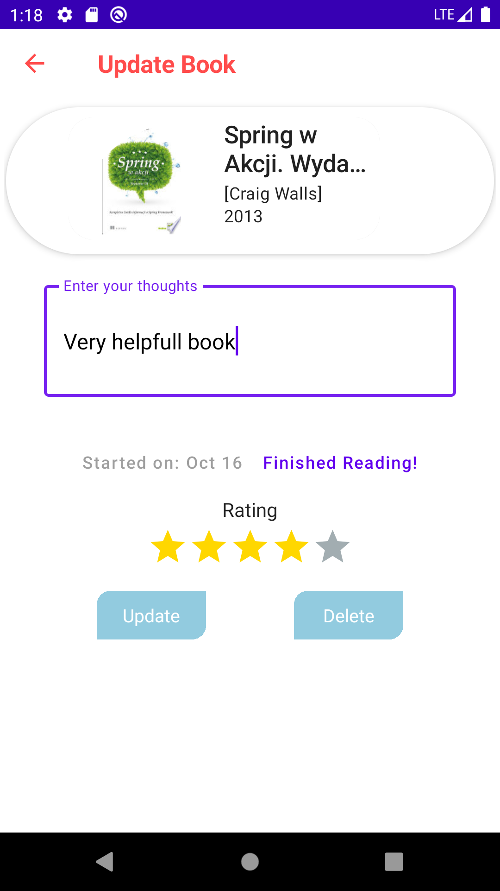
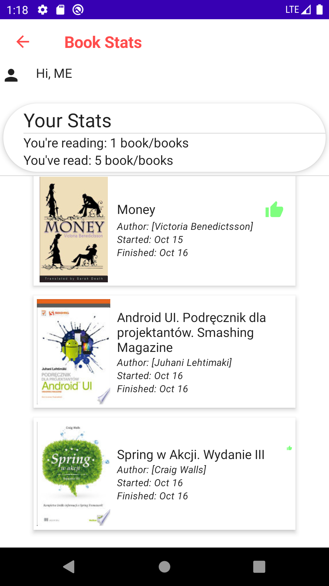

# Reader
Android application for storing and reviewing readed books - made with Udemy course.

### Tools and technologies
* Firebase
* MVVM
* Retrofit
* Coil
* DI - dagger hilt

###### API - https://books.google.com
